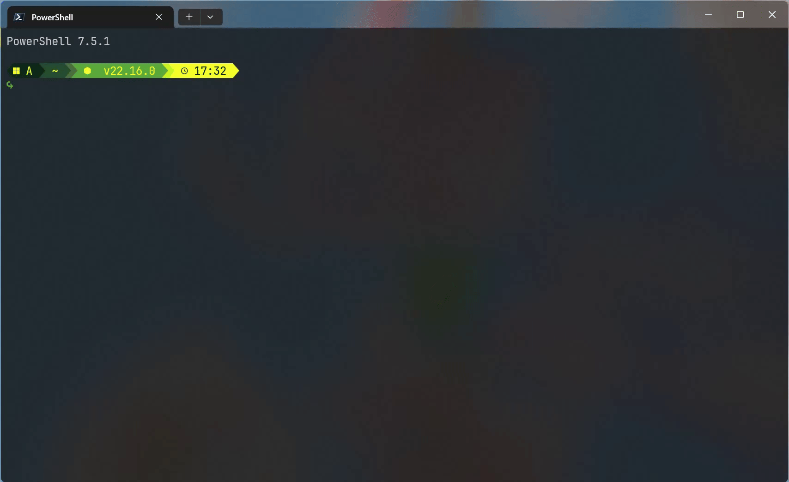

# Cyberpunk Yellow-Green

[English](readme.md)

基于 [Gruvbox Rainbow](https://starship.rs/presets/gruvbox-rainbow) 灵感设计的 [Starship](https://starship.rs/) 赛博朋克黄绿配色主题。

## 预览

## 特色

- **赛博朋克风格**：独特的黄绿色调。
- **全面支持**：针对多种操作系统和开发语言（Node.js, Python, Rust, Go, Java, PHP 等）定制图标。
- **跨平台**：支持 Windows, Linux, macOS 以及 PowerShell, Bash, Zsh 等主流 Shell。

## 使用方法

1. **安装 Starship**：参考 [官方文档](https://starship.rs/guide/#%E5%AE%89%E8%A3%85)。
2. **应用主题**：
   将 Cyberpunk Yellow-Green.toml 复制到你的 Starship 配置文件路径（通常是 ~/.config/starship.toml）。
3. **启用**：
   在 Shell 配置文件中添加初始化脚本（例如 PowerShell 添加 Invoke-Expression (&starship init powershell)）。

## 许可证

MIT License
