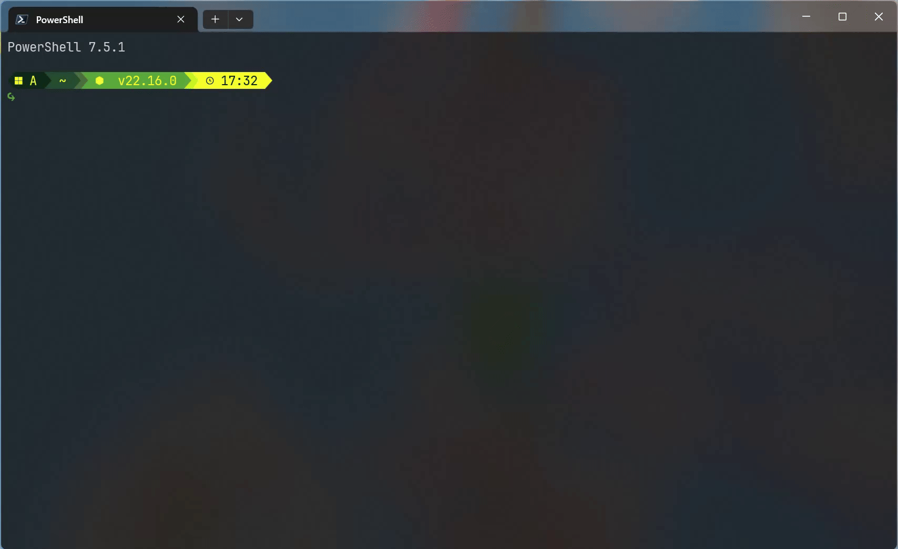

# Cyberpunk Yellow-Green 

[中文说明](readme-zh.md)

❗This project is inspired by [Gruvbox Rainbow](https://starship.rs/presets/gruvbox-rainbow). Thanks to the original authors!

This project is a cyberpunk yellow-green color theme for the [Starship](https://starship.rs/) shell prompt, suitable for Windows, Linux, and macOS. The theme file is `Cyberpunk Yellow-Green.toml`, which can be used directly to beautify your terminal experience.


## Main Features

- Cyberpunk-style yellow-green tones
- Custom icons and styles for multiple operating systems and popular programming languages
- Supports Node.js, Python, Rust, Go, Java, PHP, and more
- Beautified modules for directory, Git, time, virtual environments, etc.
- Compatible with major shells like PowerShell, bash, and zsh

## Usage

1. Install [Starship](https://starship.rs/guide/#installation)
2. Copy `Cyberpunk Yellow-Green Starship.toml` to your user home directory (e.g., `~/.config/starship.toml` or `C:\Users\<YourUsername>\.config\starship.toml`)
3. Add the following to your shell configuration file (example for PowerShell):

   ```powershell
   Invoke-Expression (&starship init powershell)
   ```

   For other shells, please refer to the [official documentation](https://starship.rs/guide/#getting-started).

## Preview



## Customization

- You can modify the `palette`, module order, icons, etc. as needed
- Supports version display for multiple programming languages and environments
- For detailed configuration options, see the [Starship official documentation](https://starship.rs/config/)

## License

This project is licensed under the MIT License.